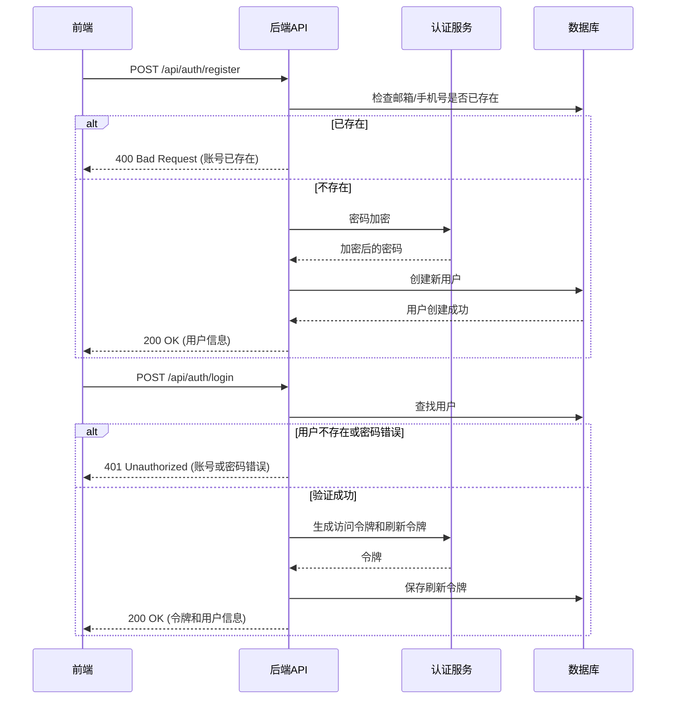

# 用户认证系统开发文档

## 1. 项目概述

本文档基于 `05_archi_skills` 项目的用户认证系统，详细分析其实现方式并提供复用方案。该系统包含完整的用户注册、登录、令牌管理、密码重置等功能。

## 2. 功能需求

### 2.1 核心功能
- **用户注册**：支持邮箱注册，包含基本信息录入和密码设置
- **用户登录**：支持邮箱/手机号登录，支持记住我功能
- **令牌管理**：JWT 访问令牌和刷新令牌机制
- **密码管理**：忘记密码、重置密码、修改密码功能
- **用户信息**：获取当前用户信息
- **第三方登录**：支持 Google、Microsoft、GitHub 等第三方账号登录

### 2.2 安全需求
- 密码加密存储（bcrypt）
- JWT 令牌认证
- 刷新令牌管理和撤销
- 密码重置安全机制
- 防暴力破解措施

## 3. 系统架构

### 3.1 技术栈
- **后端**：FastAPI + SQLAlchemy + PostgreSQL
- **前端**：Next.js 13 + React + Tailwind CSS
- **认证**：JWT + bcrypt
- **数据库**：PostgreSQL

### 3.2 架构图



## 4. 后端实现

### 4.1 目录结构

```
backend/
├── app/
│   ├── api/
│   │   └── v1/
│   │       └── endpoints/
│   │           └── auth.py       # 认证相关接口
│   ├── core/
│   │   ├── config.py             # 配置文件
│   │   └── security.py           # 安全相关功能
│   ├── database/
│   │   ├── base.py               # 数据库基础
│   │   └── session.py            # 数据库会话
│   ├── models/
│   │   ├── user.py               # 用户模型
│   │   ├── refresh_token.py      # 刷新令牌模型
│   │   └── password_reset_token.py # 密码重置令牌模型
│   ├── schemas/
│   │   └── auth.py               # 认证相关数据传输对象
│   └── services/
│       └── auth_service.py       # 认证服务
└── main.py                       # 应用入口
```

### 4.2 核心模块

#### 4.2.1 认证接口（auth.py）

**主要端点**：

| 端点 | 方法 | 功能 | 请求体 | 响应 |
|------|------|------|--------|------|
| `/api/auth/register` | POST | 用户注册 | `{"email": "...", "password": "...", "name": "..."}` | `{"id": "...", "email": "...", "name": "..."}` |
| `/api/auth/login` | POST | 用户登录 | `{"login_type": "email", "identifier": "...", "password": "...", "remember_me": true}` | `{"access_token": "...", "refresh_token": "...", "token_type": "bearer", "expires_in": 3600}` |
| `/api/auth/refresh` | POST | 刷新令牌 | `{"refresh_token": "..."}` | 新的访问令牌和刷新令牌 |
| `/api/auth/logout` | POST | 用户登出 | `{"refresh_token": "..."}` | `{"message": "登出成功"}` |
| `/api/auth/me` | GET | 获取当前用户信息 | N/A | 用户信息 |
| `/api/auth/forgot-password` | POST | 忘记密码 | `{"identifier": "..."}` | `{"message": "如果账号存在，重置链接已发送"}` |
| `/api/auth/reset-password` | POST | 重置密码 | `{"token": "...", "new_password": "..."}` | `{"message": "密码重置成功"}` |
| `/api/auth/change-password` | POST | 修改密码 | `{"old_password": "...", "new_password": "..."}` | `{"message": "密码修改成功"}` |

#### 4.2.2 安全模块（security.py）

**核心功能**：
- `verify_password()` - 验证密码
- `get_password_hash()` - 生成密码哈希
- `create_access_token()` - 创建访问令牌
- `create_refresh_token()` - 创建刷新令牌
- `verify_refresh_token()` - 验证刷新令牌
- `revoke_refresh_token()` - 撤销刷新令牌
- `get_current_active_user()` - 获取当前活跃用户

#### 4.2.3 数据模型

**User 模型**：
- `id` - 用户 ID（UUID）
- `email` - 邮箱（唯一）
- `phone` - 手机号（唯一）
- `password_hash` - 密码哈希
- `name` - 用户名
- `is_active` - 是否活跃
- `is_verified` - 是否验证
- `created_at` - 创建时间
- `updated_at` - 更新时间
- `last_login_at` - 最后登录时间

**RefreshToken 模型**：
- `id` - 令牌 ID
- `user_id` - 用户 ID
- `token` - 令牌值
- `expires_at` - 过期时间
- `is_revoked` - 是否已撤销

**PasswordResetToken 模型**：
- `id` - 令牌 ID
- `user_id` - 用户 ID
- `token` - 令牌值
- `expires_at` - 过期时间
- `used_at` - 使用时间

### 4.3 关键代码示例

#### 4.3.1 用户注册

```python
@router.post("/register", response_model=UserResponse, status_code=status.HTTP_200_OK)
def register(user_data: RegisterRequest, db: Session = Depends(get_db)):
    """用户注册"""
    # 检查邮箱是否已存在
    if user_data.email:
        existing_user = db.query(User).filter(User.email == user_data.email).first()
        if existing_user:
            raise HTTPException(
                status_code=status.HTTP_400_BAD_REQUEST,
                detail="邮箱已被注册"
            )
    
    # 检查手机号是否已存在
    if user_data.phone:
        existing_user = db.query(User).filter(User.phone == user_data.phone).first()
        if existing_user:
            raise HTTPException(
                status_code=status.HTTP_400_BAD_REQUEST,
                detail="手机号已被注册"
            )

    # 创建新用户
    hashed_password = get_password_hash(user_data.password)
    new_user = User(
        id=str(uuid4()),
        email=user_data.email,
        phone=user_data.phone,
        password_hash=hashed_password,
        name=user_data.name,
        is_active=True,
        is_verified=False,
        created_at=datetime.utcnow(),
        updated_at=datetime.utcnow()
    )

    db.add(new_user)
    db.commit()
    db.refresh(new_user)

    return new_user
```

#### 4.3.2 用户登录

```python
@router.post("/login", response_model=TokenResponse, status_code=status.HTTP_200_OK)
def login(login_data: LoginRequest, db: Session = Depends(get_db)):
    """用户登录"""
    # 根据登录类型查找用户
    if login_data.login_type == "email":
        user = db.query(User).filter(User.email == login_data.identifier).first()
    elif login_data.login_type == "phone":
        user = db.query(User).filter(User.phone == login_data.identifier).first()
    else:
        raise HTTPException(
            status_code=status.HTTP_400_BAD_REQUEST,
            detail="无效的登录类型"
        )

    # 验证用户和密码
    if not user or not user.password_hash or not verify_password(login_data.password, user.password_hash):
        raise HTTPException(
            status_code=status.HTTP_401_UNAUTHORIZED,
            detail="账号或密码错误",
            headers={"WWW-Authenticate": "Bearer"},
        )

    # 检查用户是否活跃
    if not user.is_active:
        raise HTTPException(
            status_code=status.HTTP_403_FORBIDDEN,
            detail="账号已被禁用"
        )

    # 更新最后登录时间
    user.last_login_at = datetime.utcnow()
    db.commit()

    # 创建访问令牌和刷新令牌
    access_token = create_access_token(data={"sub": user.id})
    refresh_token = create_refresh_token(user_id=user.id, remember_me=login_data.remember_me, db=db)

    return TokenResponse(
        access_token=access_token,
        refresh_token=refresh_token,
        token_type="bearer",
        expires_in=60 * 60,  # 1小时
        user_name=user.name,
        user_avatar=user.avatar_url
    )
```

## 5. 前端实现

### 5.1 目录结构

```
frontend/
├── src/
│   ├── app/
│   │   └── auth/
│   │       ├── login/
│   │       │   └── page.tsx      # 登录页面
│   │       ├── register/
│   │       │   └── page.tsx      # 注册页面
│   │       └── callback/
│   │           └── page.tsx      # 第三方登录回调
│   ├── components/
│   │   └── LoginModal.tsx        # 登录模态框
│   ├── services/
│   │   └── api.ts                # API 服务
│   └── locales/
│       ├── en/
│       │   └── auth.json         # 英文认证文本
│       └── zh/
│           └── auth.json         # 中文认证文本
├── next.config.ts
├── package.json
└── tailwind.config.js
```

### 5.2 核心功能

#### 5.2.1 登录页面

**主要功能**：
- 邮箱登录
- 密码显示/隐藏
- 记住我功能
- 第三方登录选项
- 错误处理和提示

**关键代码**：

```typescript
const handleSubmit = async (e: React.FormEvent) => {
  e.preventDefault();
  setIsLoading(true);
  setError('');
  setSuccessMessage('');

  try {
    const result = await apiService.login({
      identifier: email,
      password,
      login_type: 'email',
      remember_me: rememberMe
    });

    if (result.success && result.tokens) {
      // 存储token
      localStorage.setItem('access_token', result.tokens.access_token);
      localStorage.setItem('refresh_token', result.tokens.refresh_token);
      
      // 使用window.location.href进行跳转，避免Next.js导航问题
      window.location.href = '/';
    } else {
      setError(result.error || 'Login failed');
    }
  } catch (err) {
    setError('An unexpected error occurred');
  } finally {
    setIsLoading(false);
  }
};
```

#### 5.2.2 注册页面

**主要功能**：
- 邮箱注册
- 密码强度验证
- 密码确认
- 协议同意
- 第三方注册选项
- 错误处理和提示

**关键代码**：

```typescript
const handleSubmit = async (e: React.FormEvent) => {
  e.preventDefault();
  setIsLoading(true);
  setError('');

  if (password !== confirmPassword) {
    setError('Passwords do not match');
    setIsLoading(false);
    return;
  }

  try {
    const result = await apiService.register({
      email,
      password,
      name
    });

    if (result.success) {
      // 注册成功，跳转到登录页面
      router.push('/auth/login?registered=true');
    } else {
      setError(result.error || 'Registration failed');
    }
  } catch (err) {
    setError('An unexpected error occurred');
  } finally {
    setIsLoading(false);
  }
};
```

### 5.3 API 服务

**主要方法**：
- `login()` - 用户登录
- `register()` - 用户注册
- `refreshToken()` - 刷新令牌
- `logout()` - 用户登出
- `getCurrentUser()` - 获取当前用户信息
- `forgotPassword()` - 忘记密码
- `resetPassword()` - 重置密码
- `changePassword()` - 修改密码

## 6. 数据库设计

### 6.1 表结构

**`users` 表**
| 字段名 | 数据类型 | 约束 | 描述 |
|--------|----------|------|------|
| `id` | `VARCHAR(36)` | `PRIMARY KEY` | 用户 ID (UUID) |
| `email` | `VARCHAR(255)` | `UNIQUE, NULL, INDEX` | 邮箱 |
| `phone` | `VARCHAR(20)` | `UNIQUE, NULL, INDEX` | 手机号 |
| `password_hash` | `VARCHAR(255)` | `NULL` | 密码哈希 |
| `name` | `VARCHAR(255)` | `NOT NULL` | 用户名 |
| `is_active` | `BOOLEAN` | `DEFAULT TRUE` | 是否活跃 |
| `is_verified` | `BOOLEAN` | `DEFAULT FALSE` | 是否验证 |
| `created_at` | `DATETIME` | `DEFAULT CURRENT_TIMESTAMP` | 创建时间 |
| `updated_at` | `DATETIME` | `DEFAULT CURRENT_TIMESTAMP` | 更新时间 |
| `last_login_at` | `DATETIME` | `NULL` | 最后登录时间 |

**`refresh_tokens` 表**
| 字段名 | 数据类型 | 约束 | 描述 |
|--------|----------|------|------|
| `id` | `VARCHAR(36)` | `PRIMARY KEY` | 令牌 ID |
| `user_id` | `VARCHAR(36)` | `FOREIGN KEY (users.id), NOT NULL, INDEX` | 用户 ID |
| `token` | `VARCHAR(500)` | `UNIQUE, NOT NULL, INDEX` | 令牌值 |
| `expires_at` | `DATETIME` | `NOT NULL` | 过期时间 |
| `created_at` | `DATETIME` | `DEFAULT CURRENT_TIMESTAMP` | 创建时间 |
| `is_revoked` | `BOOLEAN` | `DEFAULT FALSE` | 是否已撤销 |

**`password_reset_tokens` 表**
| 字段名 | 数据类型 | 约束 | 描述 |
|--------|----------|------|------|
| `id` | `VARCHAR(36)` | `PRIMARY KEY` | 令牌 ID |
| `user_id` | `VARCHAR(36)` | `FOREIGN KEY (users.id), NOT NULL, INDEX` | 用户 ID |
| `token` | `VARCHAR(500)` | `UNIQUE, NOT NULL, INDEX` | 令牌值 |
| `expires_at` | `DATETIME` | `NOT NULL` | 过期时间 |
| `created_at` | `DATETIME` | `DEFAULT CURRENT_TIMESTAMP` | 创建时间 |
| `used_at` | `DATETIME` | `NULL` | 使用时间 |

## 7. 安全考虑

### 7.1 密码安全
- 使用 bcrypt 算法进行密码哈希
- 密码长度限制（最小 8 字符）
- 密码哈希加盐处理
- 密码长度超过 72 字节时进行截断

### 7.2 令牌安全
- JWT 访问令牌（1 小时过期）
- 刷新令牌（7 天或 30 天过期，取决于是否记住我）
- 刷新令牌存储在数据库中，支持撤销
- 登出时撤销所有令牌

### 7.3 其他安全措施
- 防止 SQL 注入（使用 SQLAlchemy ORM）
- 防止 XSS 攻击（前端输入验证）
- 防止 CSRF 攻击（使用 JWT）
- 密码重置令牌 15 分钟过期
- 敏感操作需要密码验证

## 8. 部署和集成

### 8.1 后端部署
1. 安装依赖：`pip install -r requirements.txt`
2. 配置环境变量（.env 文件）
3. 初始化数据库：`python scripts/init-db.sql`
4. 启动服务：`uvicorn main:app --host 0.0.0.0 --port 8000`

### 8.2 前端部署
1. 安装依赖：`npm install`
2. 配置 API 地址（.env.local 文件）
3. 构建：`npm run build`
4. 启动：`npm start`

### 8.3 集成到现有项目

**后端集成**：
1. 复制 `app/api/v1/endpoints/auth.py` 到对应目录
2. 复制 `app/core/security.py` 到核心模块
3. 复制 `app/models/` 下的认证相关模型
4. 复制 `app/schemas/auth.py` 到 schemas 目录
5. 在 `main.py` 中注册认证路由

**前端集成**：
1. 复制 `src/app/auth/` 目录到对应位置
2. 复制 `src/services/api.ts` 中的认证相关方法
3. 配置 API 基础 URL
4. 集成登录状态管理

## 9. 测试

### 9.1 后端测试
- 单元测试：`pytest tests/test_auth.py`
- 集成测试：`pytest tests/test_auth_comprehensive.py`
- 登录测试：`pytest tests/test_login.py`
- 注册测试：`pytest tests/test_register.py`

### 9.2 前端测试
- 组件测试：`npm test`
- E2E 测试：`npx cypress run`

## 10. 性能优化

### 10.1 后端优化
- 使用数据库索引（email、phone、token 字段）
- 缓存用户信息（Redis）
- 批量令牌撤销操作
- 异步处理邮件发送

### 10.2 前端优化
- 令牌存储（localStorage vs sessionStorage）
- 自动令牌刷新
- 登录状态持久化
- 错误处理和重试机制

## 11. 未来扩展

- **多因素认证**：支持短信验证码、TOTP 等
- **社交登录**：扩展更多第三方登录平台
- **SSO 集成**：支持企业单点登录
- **权限系统**：基于角色的访问控制
- **审计日志**：记录认证相关操作

## 12. 总结

本认证系统提供了完整的用户管理功能，包括注册、登录、令牌管理、密码重置等。系统采用现代化的技术栈，安全性高，扩展性强。通过复用现有代码，可以快速集成到新的项目中，减少开发时间和成本。

### 核心优势
- **安全性**：bcrypt 密码加密、JWT 令牌、刷新令牌管理
- **完整性**：完整的认证流程，包含所有必要功能
- **可扩展性**：模块化设计，易于集成和扩展
- **用户体验**：友好的前端界面，流畅的认证流程
- **兼容性**：支持多种登录方式，适应不同用户需求

通过本文档的指导，可以快速实现一个安全、可靠的用户认证系统，为应用提供坚实的用户管理基础。